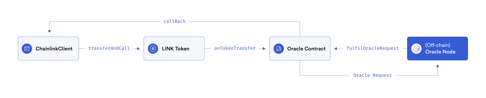

<div id="top"></div>
<!--
*** Thanks for checking out the Best-README-Template. If you have a suggestion
*** that would make this better, please fork the repo and create a pull request
*** or simply open an issue with the tag "enhancement".
*** Don't forget to give the project a star!
*** Thanks again! Now go create something AMAZING! :D
-->

<!-- PROJECT SHIELDS -->
<!--
*** I'm using markdown "reference style" links for readability.
*** Reference links are enclosed in brackets [ ] instead of parentheses ( ).
*** See the bottom of this document for the declaration of the reference variables
*** for contributors-url, forks-url, etc. This is an optional, concise syntax you may use.
*** https://www.markdownguide.org/basic-syntax/#reference-style-links
-->

<!-- PROJECT LOGO -->
<div align="center">
  <h3 align="center">Chainlink VRF implementation - using Typescript</h3>
  
  <a href="https://chain.link/">
    
  </a>
  <a href="https://polygon.technology/">
    
  </a>

  <p align="center">
    <h4>Enable EVM smart contracts to access randomness from Chainlink VRF on ETH Kovan Testnet</h4>
    <!--<br />
    Build this project from stratch: https://youtu.be/92rnG1t_55I
    <br />·-->
    <!--<a href="https://github.com/konytech/ethereum-ercs-demo">View Demo (WIP)</a>
    ·-->
    <a href="https://github.com/konytech/ethereum-ercs-demo/issues">Report Bug</a>
    ·
    <a href="https://github.com/konytech/ethereum-ercs-demo/issues">Request Feature</a>
    <br />
  </p>
</div>

<!-- TABLE OF CONTENTS -->
<ol>
  <li>
    <a href="#overview">Overview</a>
    <!-- <ul>
      <li><a href="#built-with">Built With</a></li>
    </ul>-->
  </li>
  <li><a href="#installation">Installation</a></li>
  <li><a href="#setting-environment-variables">Setting Environment Variables</a></li>
  <li><a href="#deployment">Deployment</a></li>
  <li><a href="#fund-link">Fund LINK</a></li>
  <li><a href="#random-number-request">Random number request</a></li>
  <li><a href="#read-random-number">Read random number</a></li>
  <li><a href="#test">Test</a></li>
  <li><a href="#license">License</a></li>
</ol>

<!-- OVERVIEW -->
## Overview

### Built With

* [Hardhat](https://hardhat.org/)
* [Solidity](https://docs.soliditylang.org/)
* [ethers.js](https://docs.ethers.io/)
* [Node.js](https://nodejs.org/)

<!-- GETTING STARTED -->
## Installation

1. Clone the repo
   ```sh
   git clone https://github.com/konytech/chainlink-hardhat-vrf.git
   ```
3. Install NPM packages
   ```sh
   npm ci
   ```

## Setting Environment Variables

The following environment variables are expected: `KOVAN_URL`, `PRIVATE_KEY` \
Create a `.env` file or rename <a href=".env.example">.env.example</a> to `.env` and replace the values.

`.env` example:
```
KOVAN_URL=https://eth-kovan.alchemyapi.io/v2/your-alchemy-key
PRIVATE_KEY=your-private-key
```
⚠️Never commit the `.env` file. Your mnemonic and api keys should remain private!

## Deployment

Deploy <a href="hardhat/contracts/RandomNumberConsumer.sol">the contract</a> that implements `getRandomNumber()`:
   ```sh
   npx hardhat deploy
   ```
See the <a href="hardhat/deploy/01_Deploy_RandomNumberConsumer.ts">deployment script</a> for deployment steps.

## Fund LINK

To request a random number from Chainlink VRF, the deployed contract must be funded with <a href="https://docs.chain.link/docs/link-token-contracts/">LINK tokens (ERC677)</a>.

**1 LINK** will be transfered to the contract so make sure your account contains at least 1 LINK (use the <a href="https://kovan.chain.link/">kovan faucet</a> if needed). Run:
   ```sh
   npx hardhat fund-link --contract DEPLOYED_CONTRACT_ADDRESS_HERE
   ```
See the <a href="https://www.npmjs.com/package/@appliedblockchain/chainlink-plugins-fund-link">fund-link package</a> for more details.

## Random number request

Request a new random number from Chainlink VRF:
   ```sh
   npx hardhat request-random-number --contract DEPLOYED_CONTRACT_ADDRESS_HERE
   ```
   
The request follows Chainlink's <a href="https://docs.chain.link/docs/architecture-request-model/">Basic Request Model</a> in which <a href="hardhat/contracts/RandomNumberConsumer.sol">RandomNumberConsumer.sol</a> embodies ChainlinkClient.
  
</img>
   
⚠️Wait 60 seconds for the oracle to fill the random number request before reading the result
See the <a href="hardhat/tasks/request-random-number.ts">request-random-number task</a> for more details.

## Read random number

Read the returned random number:
   ```sh
   npx hardhat read-random-number --contract DEPLOYED_CONTRACT_ADDRESS_HERE
   ```
See the <a href="hardhat/tasks/read-random-number.ts">read-random-number task</a> for more details.

## Test

An <a href="hardhat/test/integration/RandomNumberConsumer_int_test.ts">integration test</a> is available. Test steps:
- Get the deployed contract address
- Call `getRandomNumber()` from the contract in the EVM
- Wait until the oracle fulfilled the request (60s)
- Check the returned value from `randomResult()` is greater than `0`

To run the test:
   ```sh
   npm run test
   ```
   
⚠️The test assumes the deployed contract is already funded with LINK.
   
<!-- LICENSE -->
## License

Distributed under the **MIT License**.

<!-- MARKDOWN LINKS & IMAGES -->
<!-- https://www.markdownguide.org/basic-syntax/#reference-style-links -->
